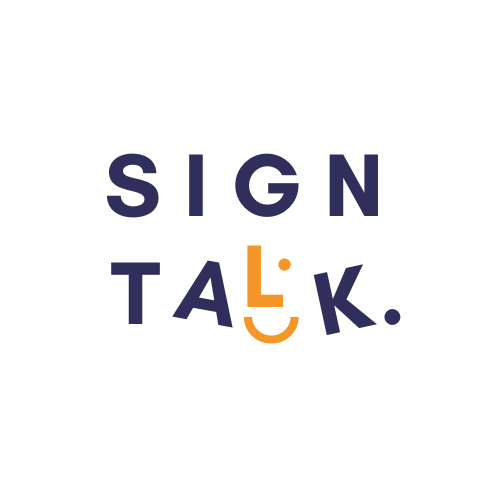

# Title: SignTalk
# Description: A Flutter app to convert speech, audio and text into sign language.

# About
We are group of students from the GIFT University, Gujranwala, Pakistan.
We are working on a project to convert speech, audio and text into sign language.
We are using Flutter for the mobile app and Python for the server.

# Technologies
- Flutter
- Python
- FastAPI (Server)
- Whisper API (Transformer)
- NLP (Glossary)
- YoutubeTranscript API (Transcript)

# Team Members
- Shakeel Khalid
- Ali Raza
- Yaseen
- Salman Ahmed

# usage
- signtalk: flutter run
- server: python main.py